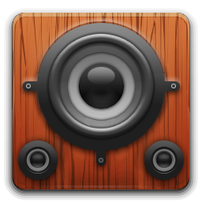

<div align="center">

<br/>



<br/><br/>

# 🎵 TuneX
## *Premium Music Experience*

**Every note, every beat — pure perfection.**
*Download • Play • Enjoy. 100% Ad-Free. Always Free.*

<br/>

[](https://python.org)
[](https://ffmpeg.org)
[](https://github.com/SOMU3103/TuneX/releases)
[](LICENSE)
[]()
[]()

<br/>


<br/>

[🌐 Website](https://somu3103.github.io/TuneX) &nbsp;·&nbsp;
[⬇️ Download](https://github.com/SOMU3103/TuneX/releases) &nbsp;·&nbsp;
[🐛 Report Bug](https://github.com/SOMU3103/TuneX/issues) &nbsp;·&nbsp;
[💼 LinkedIn](https://www.linkedin.com/in/somnath312006) &nbsp;·&nbsp;
[👤 GitHub](https://github.com/SOMU3103)

<br/>

---

```
♪ ────────────────────────────────────────────── ♪
    Download  →  Convert  →  Play  →  Repeat
    MP3 • WAV • FLAC • No Ads • No Cost • Ever
♪ ────────────────────────────────────────────── ♪
```

---

</div>

## 📖 What is TuneX?

**TuneX** is an all-in-one desktop music application built for music lovers who want complete freedom in their listening experience. It lets you **download YouTube videos as MP3**, **play your favorite tracks**, and **enjoy them fully offline** — with absolutely **zero ads, zero interruptions, zero cost**.

No account. No subscription. No compromise.

TuneX comes in **three editions** — from a lightweight Mini build all the way to a full Pro suite with batch downloading, playlist management, and keyboard shortcuts.

---

## 🎬 Project Demo

<div align="center">

<br/>

[](#)
&nbsp;&nbsp;&nbsp;
[](https://somu3103.github.io/TuneX)

<br/>

> 🎥 *Full project walkthrough video uploading soon — stay tuned!*

</div>

---

## ✨ Features

```
┌─────────────────────────────────────────────────────────────────┐
│                                                                 │
│   ⬇️  YouTube Downloader    →   Batch download multiple URLs    │
│   🎵  Music Player          →   MP3, WAV, FLAC & more          │
│   🔄  Smart Playback        →   Shuffle, repeat, seek, volume   │
│   📁  Playlist Management   →   Save & load M3U playlists       │
│   🚀  Enhanced Performance  →   Faster, better, smoother        │
│   ⚡  100% Ad-Free          →   No ads. No cost. Ever.          │
│                                                                 │
└─────────────────────────────────────────────────────────────────┘
```

---

## 📦 Editions

TuneX is available in three editions. Choose the one that fits your needs.

---

### 🎧 TuneX Mini &nbsp;`v1.0`

The original. Lightweight and essential.

- Single YouTube → MP3 download
- Basic music player with playlist support
- MP3, WAV, FLAC format support
- Simple dark theme interface
- Continuous playback mode
- Volume control & basic playback

[](https://github.com/SOMU3103/TuneX/releases/tag/v1.0)

---

### 🎶 TuneX Pro &nbsp;`v2.1` &nbsp;— *Recommended*

The full experience. Everything you need.

- ✅ **Batch YouTube Downloader** — queue unlimited URLs
- ✅ Real-time download progress tracking
- ✅ Enhanced music player with search
- ✅ Shuffle & repeat modes
- ✅ Playlist management — save/load M3U
- ✅ Duplicate track detection
- ✅ Progress seeking & volume control
- ✅ Keyboard shortcuts support
- ✅ Settings persistence
- ✅ Modern dark interface with larger fonts

[](https://github.com/SOMU3103/TuneX/releases/tag/v2.1)

---

### 🎬 TuneX**YT** &nbsp;— *Not for Music*

For when you need both video AND audio from YouTube.

- Download full video or audio — your choice
- Separate options for video and audio streams
- Advanced downloading features
- All-in-one YouTube solution

[](https://github.com/SOMU3103/TuneX/releases)

---

## 🚀 Installation Guide

> ⚠️ **FFmpeg is required** for all editions to function correctly.

### Step 1 — Install FFmpeg

```
1. Download from → https://github.com/BtbN/FFmpeg-Builds/releases
2. Get: ffmpeg-master-latest-win64-gpl-shared.zip
3. Extract to: C:\FFmpeg
4. Copy path:   C:\FFmpeg\bin
5. Add to:      System Environment Variables → PATH
```

> 💡 FFmpeg handles all audio processing inside TuneX.

### Step 2 — Download TuneX

Pick your edition from the [Releases page](https://github.com/SOMU3103/TuneX/releases) and download.

### Step 3 — Install & Launch

Run the installer and follow on-screen steps.
No registration. No account. Open and play. 🎵

---

## ⚠️ Antivirus Warning

Some antivirus software may flag TuneX during installation. This is a **false positive** — common with newly published applications.

TuneX contains **no malware, no spyware, and no viruses**.

You can verify file safety yourself on **[VirusTotal](https://www.virustotal.com)** before installing, or temporarily disable your antivirus during the installation step only.

---

## 📁 Repository Structure

```
TuneX/
│
├── 🎵 TuneX_v1.0/             # Mini edition source
├── 🎶 TuneX_v2.1/             # Pro edition source
├── 🎬 TuneXYT/                # YouTube video+audio downloader
├── 🌐 website/                # TuneX landing page (HTML/CSS/JS)
├── 📋 requirements.txt        # Python dependencies
└── 📖 README.md
```

---

## 📜 Disclaimer

> TuneX is intended for **personal use only**.
> The developers are not responsible for any misuse of this application.
> Users are fully responsible for ensuring that downloading YouTube audio complies with [YouTube's Terms of Service](https://www.youtube.com/t/terms) and applicable copyright laws.

---

## 🤝 Contributing

```bash
git clone https://github.com/SOMU3103/TuneX.git
git checkout -b feature/your-idea
git commit -m "feat: your idea"
git push origin feature/your-idea
# → Open a Pull Request
```

**Ideas welcome:**
- 🌍 Cross-platform support (macOS / Linux)
- 🎨 Light theme option
- 📱 Mobile companion app
- 🎙️ Podcast downloader mode
- 🔊 Equalizer / audio effects

---

## 📝 License

```
MIT License — Copyright (c) 2026 SOMNATH (SOMU3103)
```

---

<div align="center">

<br/>

**Made with 🎵 by [SOMU3103](https://github.com/SOMU3103)**

[](https://www.linkedin.com/in/somnath312006)
[](https://github.com/SOMU3103)
[](https://somu3103.github.io/TuneX)

<br/>

*⭐ If TuneX made your music better — give it a star. It keeps the project alive.*

<br/>

`♪ — Music should be free. TuneX makes it possible. — ♪`

</div>
